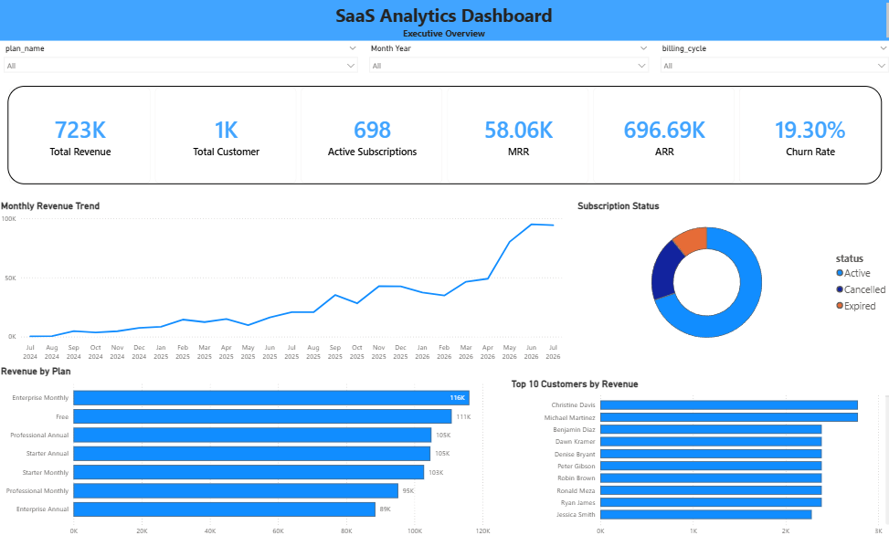
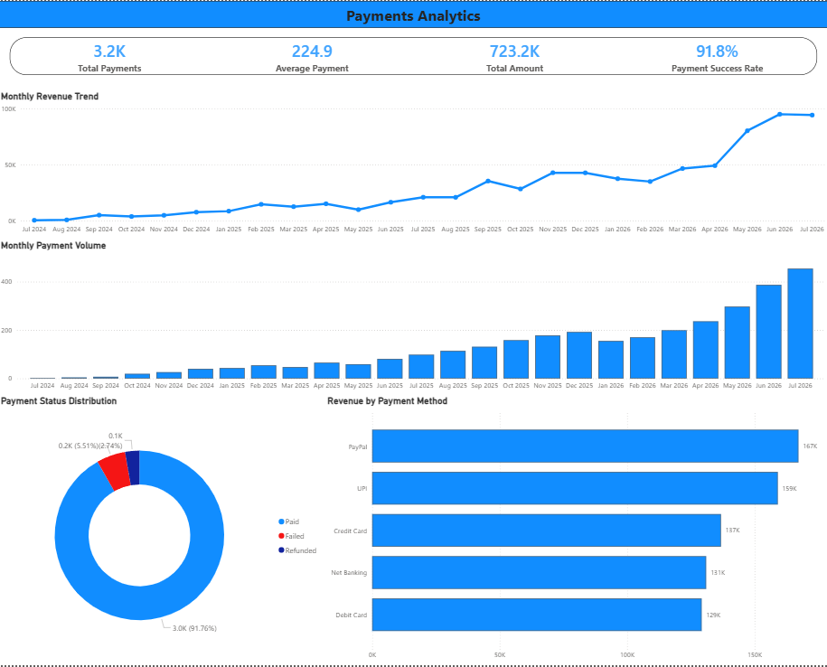
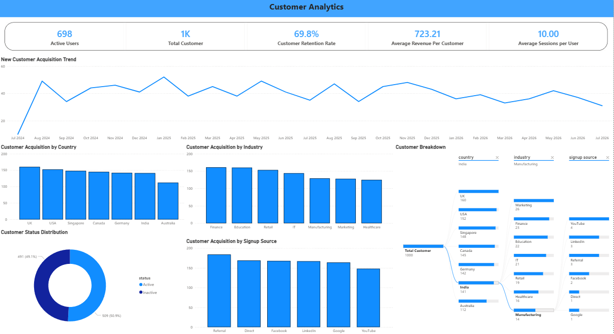

SaaS Analytics Dashboard
An interactive SaaS analytics dashboard built using Microsoft Power BI to analyze customers, revenue, payments, subscriptions, and churn.

**Project Overview**
This project transforms SaaS business data into an interactive Power BI dashboard designed to provide insights into business performance and customer behavior.

The report contains four analytical pages:
1.Executive Dashboard
2.Payments Analytics
3.Customer Analytics

**Tools & Technologies**

- Microsoft Power BI
- DAX
- Power Query
- Data Modeling
- Data Visualization
- Python
- SQL

**Dashboard Pages**

**1. Executive Dashboard**
Provides a high-level overview of SaaS business performance.

Key metrics include:

Total Revenue
MRR
ARR
Churn Rate
Subscription Performance
Revenue Trends

**2. Payments Analytics**

Analyzes payment activity and revenue performance.

Key metrics include-
Total Payments
Total Payment Amount
Average Payment
Payment Success Rate
Payment Trends
Payment Performance

**3. Customer Analytics**
Analyzes customer acquisition and customer characteristics.

Key metrics include:
Total Customers
Active Users
Customer Retention Rate
Average Revenue Per Customer
Average Sessions Per User
New Customer Acquisition
Customer Distribution by Country
Customer Distribution by Industry
Signup Source Analysis
Customer Status
Customer Breakdown

**Dashboard Preview**

**Executive Dashboard**


**Payments Analytics**


**Customer Analytics**


Analyzes subscription health and customer churn.

Key metrics include:
Active Subscriptions
Cancelled Subscriptions
Expired Subscriptions
Churn Rate
Subscription Status
New Subscription Trends
Billing Cycle Analysis
Churn by Subscription Plan

**Data & DAX**

The dashboard uses a structured data model with dimension and fact tables.

DAX measures were created to calculate important business KPIs including:

Total Customers
Active Users
Active Subscriptions
Cancelled Subscriptions
Expired Subscriptions
Churn Rate
Customer Retention Rate
Payment Success Rate
Average Revenue Per Customer
Average Sessions Per User
MRR
ARR
Total Revenue

A dedicated Date Table was also used for time-based analysis and monthly trends.

**Business Questions**

The dashboard helps answer questions such as:

- How is the SaaS business performing?
- How many customers are active?
- How effectively are new customers being acquired?
- Which countries and industries contribute the most customers?
- How successful are payments?
- How healthy is the subscription base?
- What is the current churn rate?
- How are subscriptions changing over time?

**Key Metrics**

**Total Customers** - 1,000
**Active Users** - 698
**Customer Retention Rate** - 69.8%
**Active Subscriptions** - 698
**Cancelled Subscriptions** - 193
**Expired Subscriptions** - 109
**Churn Rate** - 19.30%
**Average Revenue Per Customer** - 723.21

> Values are based on the current project dataset.

#Repository Contents

```text
SaaS-Analytics-PowerBI/
│
├── README.md
├── SaaSmodel.pbix  
└── screenshots/
